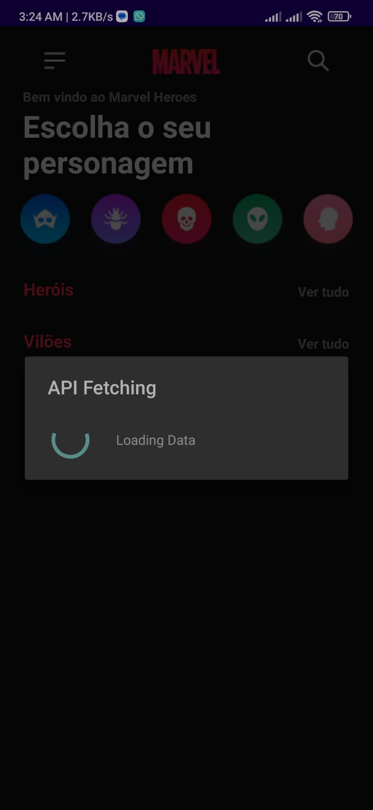
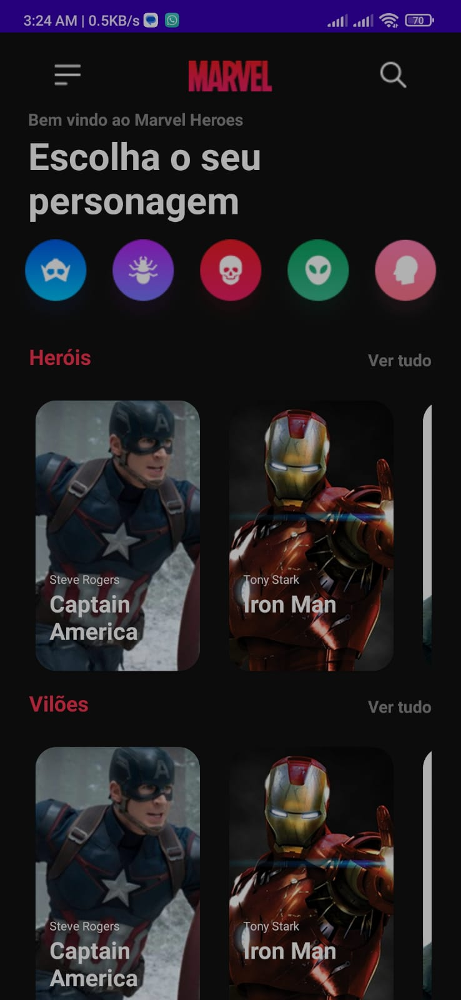
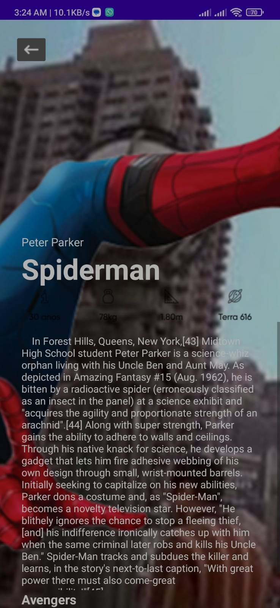
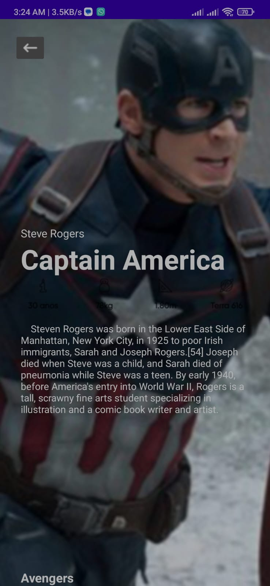

<h1> Marvel-Android-Project </h1>
 
<h2> call data from API and return it </h2>
 
<h1>Fetching Data </h1>
 

 

<h1>Received Data </h1>
 

 

<h1> Details Fetched from api based on marvel character  </h1>
 

 

